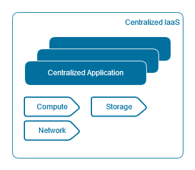
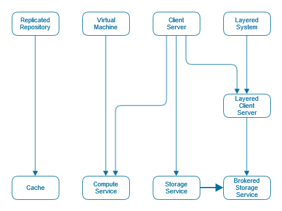
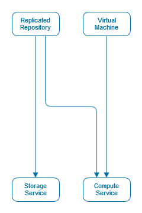
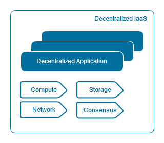
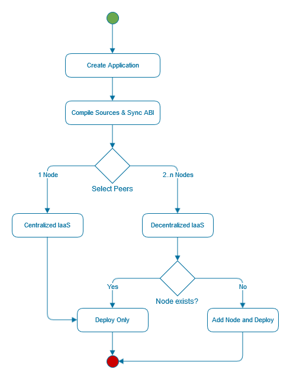
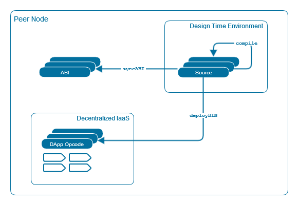
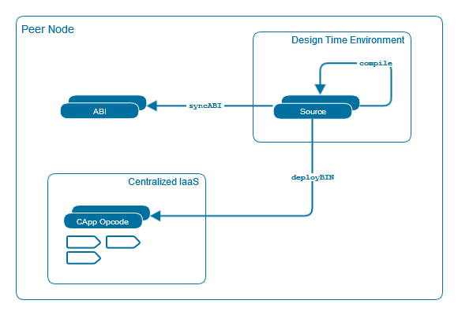
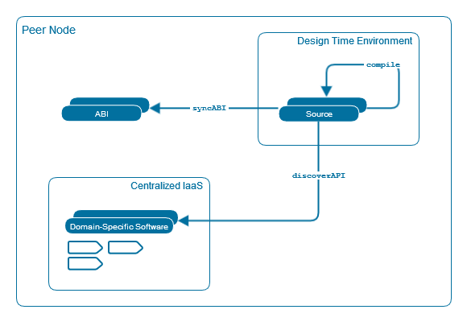
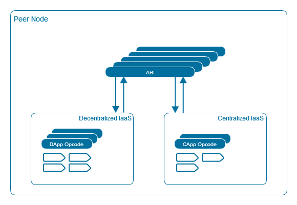
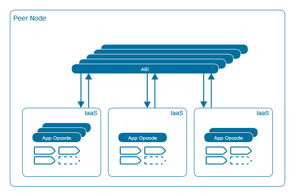

# Infrastructure as a Service Styles for Centralized and Decentralized Applications - Distributed System State Partitioning

## Background
We argue, that despite the fact that application and infrastructure address different layers of a system, the chosen infrastructure can influence the application being developed. For a system to be implemented in a straightforward manner on top of an infrastructure, the application has to be compliant with the architectural constraints imposed by the infrastructure[1].

Existing distributed systems often use message oriented middleware (MOM) to reach agreement between the participating nodes. This works generally fine with distributed systems of centralized applications but is suboptimal with distributed systems of decentralized applications where each node makes a decision on its own while the resulting system behavior is the aggregated response of the participating nodes.

In this invention we propose a new transaction oriented middleware (TOM) for distributed systems of decentralized applications. Furthermore we require the application developer to categorize its application upfront as either centralized or decentralized so that the compliant infrastructure is chosen.

---
## State of the Art Technology
### Platform
Any application can be perceived as composed of a core infrastructure and potentially some domain-specific software hosted by a dedicated instance.

#### Core Infrastructure
The first-class services offered by the core IaaS system are:
- Network
- Compute
- Storage

<!---->

_Generally a fourth core service - Messaging - exists which is equally relevant for centralized and decentralized applications; in this document we are not discussing messaging as a general core service but rather as a legacy  MOM sub-system used by distributed systems to reach consensus._

#### Domain-Specific Software
The core infrastructure only provides the most basic infrastructure, however complex applications require domain-specific software as well. Examples are:
- Business Intelligence
- Enterprise Resource Planning
- Customer Relationship Management

#### Virtualization
By the means of _virtualization_ we ensure that independent applications, centralized or decentralized, are hosted by a dedicated instance of such a system, greatly improving efficiency.

### Network-based Architectural Styles
Styles are a mechanism for categorizing architectures and for defining their common characteristics. Traditionally, the network services are almost exclusively derived from the client-server style. The following graph depicts how some typical styles are derived[2]; the list is by no means complete.

**Cache** - A variant of replicated repository; replicating the result of an individual request such that it may be reused by later requests.

**Layered Client-Server** - This style adds proxy and gateway components to the client-server style. A proxy acts as a shared server for one or more client components, taking requests and forwarding them, with possible translation, to server components. A gateway component appears to be a normal server to clients or proxies that request its services, but is in fact forwarding those requests, with possible translation, to its _inner-layer_ servers. These additional mediator components can be added in multiple layers to add features like load balancing and security checking to the system.

**Compute Service** - If derived from the client-server and virtual machine styles, a client component has the know-how necessary to perform a service, but lacks the resources required, which happen to be located at the server. Consequently, the client sends the know-how to the server component, which in turn executes the code using the resources available there. The results of that execution are then sent back to the client. Alternatively, a client component has access to a set of resources, but not the know-how on how to process them. It sends a request to a remote server for the code representing that know-how, receives that code, and executes it locally.

**Storage Service** - If derived from client-server style, a system is organized as a set of components interacting as peers. In order for one storage object to interact with another, it must know the identity of that other storage object. When the identity of an storage object changes, it is necessary to modify all other storage objects that explicitly reference it.

**Brokered Storage Service** - In this style, derived from the storage service above and layered client-server styles, a name resolver components is introduced whose purpose is to answer client requests for general service names with the specific name of an storage object that will satisfy the request.

## Disadvantages of Closest Prior Art
Existing distributed systems do not differentiate between centralized and decentralized applications upfront, instead an application centric approach is taken, delegating maintenance of the system state to the MOM sub-system, e.g. with the storage service derived from client-server style, there must be some controller service that is responsible for maintaining the system state.

In fact, we argue, in order to build a reliable system it is crucial to understand where system state is maintained.

While the basic form of client-server does not constrain how system state is partitioned between client and server, if the state is kept entirely on the client, a reliable distributed systems of centralized applications can be built. Conversely, the client-server based style does not allow for a reliable distributed system of stateful decentralized applications.

---
## Concept
The applications hosted by a decentralized infrastructure are not materially different from those hosted by a centralized infrastructure; the services provided by a decentralized infrastructure are similar in spirit to centralized infrastructure services. However decentralized applications require the infrastructure to reliably support shared system state.

### Network-based Architectural Styles
To achieve this, the network services shall be derived from the replicated repository style instead. The following graph depicts how the core compute and storage services are derived.

**Storage Service** - A variant of replicated repository; replicating the storage objects as well as the shared system state.

**Compute Service** - If derived from the replicated repository and virtual machine styles, each peer has access to a set of resources as well as the know-how necessary to perform a service.

### Platform
By adding a transactional singleton machine with shared system state we are able to eliminate the MOM sub-system, borrowing from this term we call the new sub-system TOM.

#### Core Infrastructure
Adding the Consensus service in addition to the other first-class services Network, Compute, and Storage allows us to build a transactional singleton machine with shared system state, therefore reliably supporting decentralized applications.

#### Domain-Specific Software
Such domain-specific software is often built by third parties and is often available only as a centralized version. There are essentially two options to make it available to a decentralized application:
1. by the third-party provider as a decentralized version
1. via an integration point

We assume that the first option is often not viable and therefore conclude that third-party centralized domain-specific software needs to be made accessible to the decentralized application via integration points.

#### Virtualization
Virtualization provides a dedicated instance for 1..n _related_ applications running on top of a shared physical node.

## Implementation
In this invention we introduce a new system that requires the user to decide between two Infrastructure as a Service (IaaS) styles, either for centralized or decentralized applications. The system in turn will then configure and deploy the _core infrastructure_ and _domain-specific software integration points_ so that the user application either runs as a centralized or decentralized application.

### Design Time
For the user this means he does not have to worry about the middleware used and how system state is maintained, instead he can concentrate on its application. When deploying the application, the user merely needs to select the participating peers; the system itself will then setup the compliant IaaS and deploy the application accordingly.

In order to make the application transparent with respect to its compliant infrastructure, the ABI is separated from the Opcode.

Decentralized systems don't need to be decentralized end-to-end, significant parts of the infrastructure can remain centralized. This has a great effect on efficiency since centralized infrastructure is usually significantly faster and cheaper compared to decentralized.

Similarly, centralized domain-specific software can be made available to a decentralized application via an integration point. The domain-specific software therefore just becomes a special case of a centralized application where the opcode is provided by a third-party and not deployed by the system itself; consequently, the system needs to discover the API and synchronize it to the node's ABI.

### Runtime
The nodes of the distributed system only interact via the ABI. The application specific details are transparently served be the infrastructure, be it centralized or decentralized.

We are not disclosing the implementation details of the services provided by the infrastructure, we are only stating that in the centralized case the compute and storage services are derived from the client-server style while in the decentralized case they are derived from the replicated repository style; in turn the user can rely on the system to reliably partition the system state between the participating nodes of an application.

Additionally, virtualization will be transparently done for the user ensuring that _related_ applications share the same infrastructure.

---
## Glossary
**Centralized application** - One dedicated networked computer hosts the application and therefore controls the system behavior.

**Decentralized application** - Each networked computer independently makes a decision while the resulting system behavior is the aggregated response of the involved networked computers.

**Distributed system** - A system whose components are located on different networked computers, which communicate and coordinate their actions by passing messages to one another[3].

**Node** - A networked computer.

---
## References
1. E\. Di Nitto and D. Rosenblum. Exploiting ADLs to specify architectural styles induced by middleware infrastructures. In Proceedings of the 1999 International Conference on Software Engineering, Los Angeles, May 16-22, 1999, pp. 13-22.

2. Fielding, Roy Thomas. Architectural Styles and the Design of Network-based Software Architectures. Doctoral dissertation, University of California, Irvine, 2000.

3. Tanenbaum, Andrew S.; Steen, Maarten van (2002). Distributed systems: principles and paradigms. Upper Saddle River, NJ: Pearson Prentice Hall. ISBN 0-13-088893-1.

---
